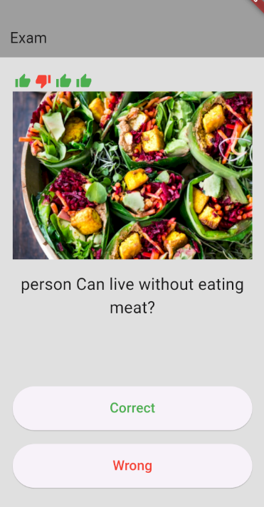
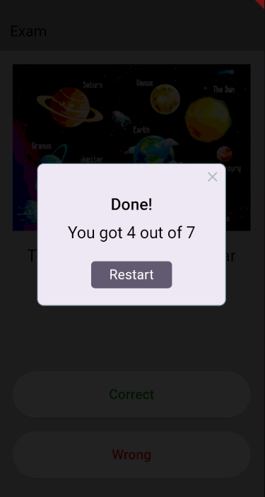

# Flutter Learning Process

This repository documents my journey of learning Flutter, a popular framework for building cross-platform mobile applications using a single codebase.

## Project : [QuestionApp]

Description: This Question Game when your answer its correct it will show thumps app or down and at the the end show you the total".

## License

This project is licensed under the [Ali Alsheala](LICENSE).
